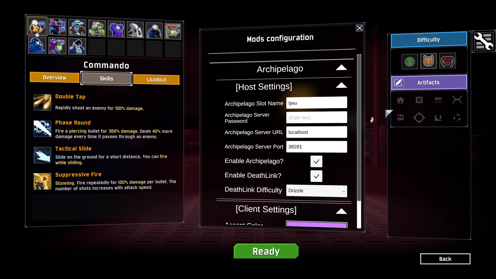

# Archipelago.RiskOfRain2 | 

This mod adds support to Risk of Rain 2 for playing as an Archipelago client. For more information on Archipelago head over to https://archipelago.gg or join our Discord.

Should be multiplayer compatible, but not rigorously tested. Be sure to scale up your YAML settings if you play in multiplayer. All players require the mod in multiplayer.

## Gameplay 

The Risk of Rain 2 players send checks by causing items to spawn in-game. Currently this includes opening chests, defeating bosses, using scrappers and 3D printers, opening lunar pods, and accessing terminals. 
An item check is only sent out after a certain number of items are picked up. This count is configurable in the player's YAML.

### Achieving Victory or Defeat

Achieving victory is defined as beating Mithrix, losing in commencement, or obliterating.

Due to the nature of roguelike games, you can possibly die and lose your place completely. This is mitigated partly by the free grants of `Dio's Best Friend`
but it is still possible to lose. If you do lose, you can reconnect to the Archipelago server and start a new run. The server will send you the items you have
earned thus far, giving you a small boost to the start of your run.

## YAML Settings
An example YAML would look like this:
```yaml
description: Ijwu-ror2
name: Ijwu

game:
  Risk of Rain 2: 1

Risk of Rain 2:
  total_locations: 15
  total_revivals: 4
  start_with_revive: true
  item_pickup_step: 1
  enable_lunar: true
  item_weights:
    default: 50
    new: 0
    uncommon: 0
    legendary: 0
    lunartic: 0
    chaos: 0
    no_scraps: 0
    even: 0
    scraps_only: 0
  item_pool_presets: true
  # custom item weights
  green_scrap: 16
  red_scrap: 4
  yellow_scrap: 1
  white_scrap: 32
  common_item: 64
  uncommon_item: 32
  legendary_item: 8
  boss_item: 4
  lunar_item: 16
  equipment: 32
```

| Name | Description | Allowed values |
| ---- | ----------- | -------------- |
| total_locations | The total number of location checks that will be attributed to the Risk of Rain player. This option is ALSO the total number of items in the item pool for the Risk of Rain player. | 10 - 50 |
| total_revivals | The total number of items in the Risk of Rain player's item pool (items other players pick up for them) replaced with `Dio's Best Friend`. | 0 - 5 |
| start_with_revive | Starts the player off with a `Dio's Best Friend`. Functionally equivalent to putting a `Dio's Best Friend` in your `starting_inventory`. | true/false |
| item_pickup_step | The number of item pickups which you are allowed to claim before they become an Archipelago location check. | 0 - 5 |
| enable_lunar | Allows for lunar items to be shuffled into the item pool on behalf of the Risk of Rain player. | true/false |
| item_weights | Each option here is a preset item weight that can be used to customize your generate item pool with certain settings. | default, new, uncommon, legendary, lunartic, chaos, no_scraps, even, scraps_only |
| item_pool_presets | A simple toggle to determine whether the item_weight presets are used or the custom item pool as defined below | true/false |
| custom item weights | Each defined item here is a single item in the pool that will have a weight against the other items when the item pool gets generated. These values can be modified to adjust how frequently certain items appear | 0-100|


Using the example YAML above: the Risk of Rain 2 player will have 15 total items which they can pick up for other players. (total_locations = 15)

They will have 15 items waiting for them in the item pool which will be distributed out to the multiworld. (total_locations = 15)

They will complete a location check every second item. (item_pickup_step = 1)

They will have 4 of the items which other players can grant them replaced with `Dio's Best Friend`. (total_revivals = 4)

The player will also start with a `Dio's Best Friend`. (start_with_revive = true)

The player will have lunar items shuffled into the item pool on their behalf. (enable_lunar = true)

The player will have the default preset generated item pool with the custom item weights being ignored. (item_weights: default and item_pool_presets: true)

## Connecting to an Archipelago Server

I assume you already have an Archipelago server running. Instructions on how to run a server are available on https://archipelago.gg.

There will be a menu button on the right side of the screen. Click it in order to bring up the in lobby mod config. From here you can expand the Archipelago sections and fill in the relevant info.

Keep password blank if there is no password on the server.



Simply check `Enable Archipelago?` and when you start the run it will automatically connect and print a message stating successful connection in your in-game chat.

## Changelog
Internal versions are unreleased versions of the mod. They are pointed out in the changelog so that I can sort my work and to allow others to follow my progress between releases.

**2.0**

Changes:

* Internal rewrite of most code components.
    * Most functionality should be the same as before, differences are noted here.
* New options in the lobby config menu for DeathLink and accent color choice.
    * Accent color is the color of your location check bar. It's customizable now!
    * DeathLink NOT currently implemented.

REMOVED FEATURES:
* Auto reconnection. I will probably try to re-implement this at another time.

**1.0.2**

* Update supported Archipelago version to function on current AP source.

**1.0.1**

* Fix chat box getting stuck on enabled sometimes.
* Stop lunar coins, elite drops, artifacts, and artifact keys from counting towards location checks.
    * Enables going to Bulwark's Ambry while you have location checks left.
* Names not appearing in multiplayer fixed.
* Fix lunar equipment grants not previously working.

**1.0 (First Stable Release)**

* Release of all changes from 0.1.5 up to 0.1.7.
* This version purely denotes a release, no new features or fixes were made.

**0.1.7 (Internal Version)**

* Allow for obliteration or fealty endings to work as AP session completion events. You don't _have_ to go to commencement anymore.
* Fix bug with objective display being wrong after game re-make.
* Fix bug with location check progress bar doubling on clients that are not the host.
* Fix bug with location check progress bar not working after reconnect. todo
* Chat messages from players who are not host now send to the multiworld correctly. (But under the name set in the YAML as it's only one slot for the whole RoR session)
* Remove location check progress bar from UI when all checks are complete.

**0.1.6 (Internal Version)**

* UI code refactor. Not visible to users, but code is slightly cleaner.
* Add `archipelago` console command. Syntax: `archipelago <url> <port> <slot> [password]`
* Reconnect logic is greatly improved. Now attempts to reconnect every 5 seconds for 5 tries. If it fails entirely, you can use the archipelago command.
* Your existing equipment drops at your feet when you are granted one from the server. The new one swaps into the slot.
* Add objective tracker for total number of checks remaining.

**0.1.5 (Internal Version)**

* Chat messages go out to the multiworld now.
* Smoke effect now appears when an item drop is turned into a location check as a visual indicator of sending out a check.
* Remove `total_items` YAML option as it doesn't work as intended.
* Other formatting tweaks to README.
* Add HUD for location check progress. Now appears as a bar under your health bar. When it fills up all the way it will reset and you will send out a check.

**0.1.4**

* Update `Newtonsoft.Json.dll` to the correct version, this fixes the client failing to connect to the server.

**0.1.3**

* Set InLobbyConfig as hard dependency.
* Update README to reflect that all players require the mod at the moment.
* Add `total_items` YAML option to README.
* Add `enable_lunar` YAML option to README.

**0.1.2**

* Add R2API as a dependency.

**0.1.1**

* Fix victory condition sending for commencement.
* Remove splash+intro cutscene skip (was for debugging purposes).

**0.1.0**

* Initial version.

## Known Issues

* Splitscreen support is unlikely at the moment. It might work, it might not.
* If you start a new run but join an existing AP session, you will get spammed with notifications for all your pickups.
* Reconnect breaks location check progress bar.


## To-do/Ideas

* Cache and load data package from file system.
* Further randomization in some way. Mob spawns, elite types, variance api, boss types, mob families, mobs with items, etc.
* More item/reward types: money, exp, warbanner drops, drones
* Funny/joke item types: launching you into the air, switch left and right click
* Trap item types: spawn a family of mobs on you, spawn bosses, drop bombs on the stage
* Randomize order of check sending.
* YAML options for types of item drops? Chests/Scrapper/Multishop/Boss/LunarCoin/GoldChests
* Add objectives so that certain number of checks per level required per portal
* Randomize pickup step every stage or every check?
* Prevent game over if dios still present in item pool.
